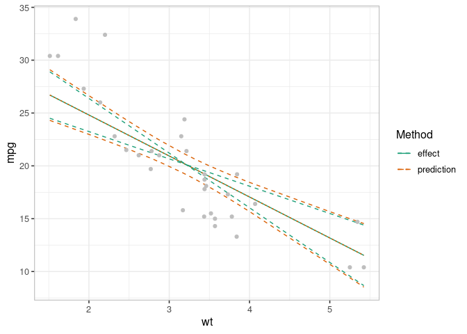

varpred
=======

<!-- badges: start -->

<!-- badges: end -->

The development of this package is motivated by the water, sanitation,
and hygiene (WaSH) data in which we were interested in investigating the
contribution of demographic and socio-economic factors to improved WaSH
indicators among the slum dwellers in Nairobi, Kenya. We noticed that
the predictions we generated using the existing packages consistently
over- or under- estimated the observed proportions; and did not align
well with the observed data points. In other words, what we call . There
are several (challenges) reasons for this, including:

-   the choice of the
-   uncertainty estimation – the choice of for computing confidence
    intervals
-   biases induced by non-linear averaging due to non-linear
    transformation in generalized linear models

It implements two approaches for constructing outcome plots (prediction
and effect plots). These include:

-   **mean-based** approach
-   **observed-value** approach

It can also be used to generate bias-corrected prediction and effect
estimates for generalized linear models involving non-linear link
functions, including models with random effects. This package
complements the existing ones by providing:

-   a straightforward way to generate effects plots
-   a robust way to correct for non-linear averaging bias in generalized
    (mixed) models

Installation
------------

You can install the development version of varpred from
[GitHub](https://github.com/cygubicko/varpred) with:

    # install.packages("remotes")
    remotes::install_github("CYGUBICKO/varpred")

Example
-------

We use `mtcars` data to show outcome plots:

-   `isolate=TRUE` to generate effect plot
-   `isolate=FALSE` to generate prediction plot

<!-- -->

    library(varpred)
    library(ggplot2)

    ## Set theme for plots
    varpredtheme()

    ## Fit the model
    mod <- lm(mpg ~ wt + hp, mtcars)

    ## Effect
    ef <- varpred(mod, "wt", isolate=TRUE, modelname="effect")
    plot(ef)

    ## Prediction
    pred <- varpred(mod, "wt", isolate=FALSE, modelname="prediction")
    plot(pred)

    ## Compare effect and prediction
    all_v <- combinevarpred(list(ef, pred))
    p1 <- plot(all_v)

    ## Add observed data
    print(p1
        + geom_point(data=mtcars, aes(x=wt, y=mpg), col="grey")
        + labs(colour="Method", linetype="Method")
    )

